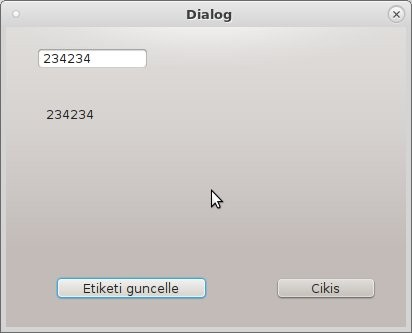

Örnek
=====

Tek Pencere
-----------
İçinde tek pencere olan basit uygulama yazacağız. İki buton, bir metin giriş alanı,
bir etiket bulunan pencer içinde, nesnelerin birbiriyle nasıl etkileştiğini göreceğiz.
Ayrıca oluşturduğumuz ekran tasarımını nasıl uygulamaya çevireceğimizi de ilerleyen
sayfalarda bulacaksınız.

   Dialog tipinde boş sayfa ile başlıyoruz.

   Boş ekranımız, üzerine iki buton, bir label, bir de edit box yerleştireceğiz.

.. figure:: ../images/qt-003.png
   :scale: 35 %
   
   Butonlar.

   Label ve edit box. Sağ üstte bulunan Object Inspector ile nesne isimlerini düzenleyelim. Nesne isimlerini belirli bir kurala göre verin. Uygulama içinde bu isimler kullanılacak.

.. figure:: ../images/qt-005.png
   :scale: 35 %
   
   Sinyal/Slot baglantılarını, yani bu pencere için yazılacak metod/fonksiyon isimlerini tanımlamak için, tasarım ekranını signal/slot moduna almak için kırmızı okla gösterilen butona basın.

	
   Uygulamayı kapatmak için kullanacağımız butona tıklayıp, pencere üzerinde boş alana sürüklüyoruz. Mouse tuşunu bıraktığımızda yukarıdaki ekran gelir. Configure Connection penceresinde close() metodunu görebilmek için, sol altta bulunan 'show signals and slots inherited from Qwidget' kutucuğunu işaretleriz. Çıkan listeden close seçip Ok tuşuna basarız.

.. figure:: ../images/qt-007.png
   :scale: 35 %
   
   Etiket güncelle butonu için, bir önceki butonda yaptığımız gibi, butonun üzerinden pencere üzerinde boş alana sürükleyip bırakırız. Çıkan ekranda, Configure Connection kısmında, clicked() sinyali için sağ tarafta hedef metodun ismini oluşturmamız gerekiyor. Bunun için 'Edit…' butonuna tıklayıp, ekrana gelen 'Signal/Slots of DlgOrnek' penceresinde üstte görünen yeşil + butonuna tıklarız. Slots listesine slot1() eklenir. Slot1() üzerine çift tıklayıp adını etiket_guncelle() yapacağız. Sonundaki parantezler önemlidir. Ok butonuna basıp, bir alttaki ekrana geçeriz.

.. figure:: ../images/qt-008.png
   :scale: 35 %
	
   Configure Connection ekranında, clicked() için sağ tarafta etiket_guncelle() seçilmelidir. Ok tuşuna basıp devam edilir. Bu aşamada designer uygulaması ile işimiz bitiyor. Dosyayı ornek.ui ismi ile kaydedip designer uygulamasını kapatırız.

Designer ile ui dosyasını kullanabilmek için pyside2-uic uygulamasını kullanırız. Linux için aşağıdaki gibi çağırılır:
   
    pyside2-uic ornek.ui > ui_ornek.py

Windows sistemlerde aynı uygulama python dizininin içindeki Scripts dizinindedir. Python kurulumunuz C:\\Python3.7 olsun. pyside-uic uygulamasını aşağıdaki gibi çağırırız:

    C:\\Python3.7\\Scripts\\pyside2-uic.exe  ornek.ui > ui_ornek.py

Şimdi, bu ekran tasarımını python koduna çeviriyoruz. Pyside2-uic yerine qt5 ile gelen uic uygulamasını kullanabilirsiniz. Yukarıdaki komut sonrasında elimizde ui_ornek.py dosyası olacaktır. Bu ui_ornek dosyasının içine hiçbir ek yapılmamalıdır.

.. literalinclude:: ../ornekler/001/main.py
   :language: python

Değişikliklerin yapılabileceği main.py dosyasının içeriği yukarıdaki gibidir. Designer ile oluşturulan arayüz dosyasından üretilen sınıf, kendi penceremizi oluşturmak için kullanılmıştır. Ui_DlgOrnek, uic ile üretilen ui_ornek.py içindedir.

   Uygulamamızı komut satırından, python main.py diyerek çalıştırınca, karşımıza yukarıdaki ekran çıkar.

Görüldüğü üzere, pencere içindeki yerleşim düzensizdir. Şimdi yapacağımız işlem, pencere boyutlandırıldığında içindekilerin de bu boyutlandırma işlemine uymasını sağlayacaktır. Pencere içinde Layout ayarlaması yapacağız. Bunun için yeniden ornek.ui dosyasını designer uygulamasi ile düzenleyeceğiz.

.. figure:: ../images/qt-011.png
   :scale: 35 %

   Layout oluşturma.
	   
Tasarıma küçük ekle yapıyoruz. Burada iki buton arasına yatay spacer ekliyoruz. Ardından, iki buton ve yatay spacer'i mouse ile seçerek, sağ mouse tuşuna tıkladığımızda, çıkan popup menünün en alt seçeneğinde Layout görürüz. Üzerine geldiğimizde, Horizontal Layout seçeriz. Böylece, bu iki buton ve spacer, bir yatay layout grubu oluştururlar. Ardından, pencerede boş bir alana sağ tuş ile tıklayıp, yine Layout kısmında 'Layout Vertically' seçersek, editbox, label, dikey spacer ve az önce oluşturduğumuz yatay layout grubu yeni bir Layout grubu oluşturur. Designer içinde yapılacaklar bitmiştir. Kaydedip çıkarız.

Bu aşamada, elimizde yeni bir ui dosyası ve yazılmış uygulama bulunmaktadır. Yeni ornek.ui dosyasını pysideuic (ya da pyqt5 icin pyuic) uygulamasından geçirip yeni ui_ornek.py dosyasını oluştururuz. Bu aşamada sadece görsel değişiklik yaptığımız için, main.py içinde değişiklik gerekmez. Uygulamayı yeniden çalıştırırsak, pencerenin boyutlanması ile içindeki nesnelerin de ona göre hareket ettiklerini göreceğiz.

.. figure:: ../images/qt-012.png
   :scale: 55 %

   Boyutlandırma

.. figure:: ../images/qt-013.png
   :scale: 55 %	   

   Boyutlandırma.

Resim Kullanımı
---------------
Bir uygulamada nasıl resim kullanabileceğimizi göreceğiz.

Designer kullanarak bir buton, iki label bulunan bir ekran tasarlayacağız. Layout yerleşimi gibi konular yukarıda bahsedildiği için doğruca uygulamaya geçeceğiz.

.. figure:: ../images/qt-resimgosterici-001.png
   :scale: 55 %

   Uygulama için gerekli herşey. Butonlar, signal/slot bağlantıları, vs.

Şekilde görüldüğü gibi, içini doldurmamız gereken dosyaSec fonksiyonumuz bulunmaktadır. Bu fonksiyon, btnDosyaSec butonu tıklandığında çalışacaktır. Şekilde sağ altta görülen signal/slot editor kısmındadır.

Seçilen resim dosyasını QLabel tipindeki lblResim nesnesinin üzerine yerleştireceğiz. Seçilen dosya adını da yine QLabel tipindeki lblDosyaAdi nesnesi görüntüleyecektir.

Linux sistemlerde:

    ~$ pyside2-uic  resimgosterici.ui  > ui_resimgosterici.py

Windows sistemlerde aynı uygulama python dizininin içindeki Scripts dizinindedir. Python kurulumunuz C:\\Python3.7 olsun. pyside-uic uygulamasını aşağıdaki gibi çağırırız:

    C:\\Python3.7\\Scripts\\pyside2-uic.exe  resimgosterici.ui  > ui_resimgosterici.py

    
Yukarıdaki komut ile ekran tasarımını import edebileceğimiz python kaynak koduna çeviririz. Çok yapılan hatalardan birisi de, üretilen bu dosya içine kendi kodlarımızı yazmaya başlamaktır. Dosyanın giriş kısmında 'WARNING! All changes made in this file will be lost!' uyarısını dikkate almak gerekir. Arayüz ile kendi yazdığımız kısımları farklı dosyada tutmamız, arayüzde yapılacak değişikliklerden kendi yazdığımız kısmın etkilenmemesini, aynı zamanda da designer ile yaptığınız görsel değişikliklerin devreye alınmasını sağlar.

Aşağıda, üretilmiş olan arayüzü kullanan ve bu haliyle pencereyi görüntüleme dışında hiçbir şey yapmayan kod parçası bulunmaktadır. dosyaSec fonksiyonunu yazarak, uygulamanın istediğimiz işi yapmasını sağlayacağız.

.. literalinclude:: ../ornekler/002/resim.py
   :language: python

	     

QFileDialog nesnesi, bize dosya seçim penceresi sunar. getOpenFileName metodu ise dosya adı ve dosya tipi içeren ikili sonuc döndürür. Yukarıdaki uygulamada dosyaSec metodunu aşağıdaki kod bloğu ile değiştirdiğimizde, seçtiğimiz dosyanın lblResim nesnesi üzerinde görüntülendiğini görürüz.

.. code-block:: python
      
   def dosyaSec(self):
      fname, ftype = QFileDialog.getOpenFileName(self, 'Open file',
      '',"Image files (*.jpg *.gif)")
      self.lblResim.setPixmap(QPixmap(fname))

   Dosya seçme
	   
.. figure:: ../images/qt-resimgosterici-003.png
   :scale: 55 %

   Görüntüleme

Çoklu Pencere
-------------
İçinde birden fazla pencere olan, bir butonla diğer pencereyi açabildiğimiz uygulamayı yazacağız. Yukarıda yazdığımız resim gösteren uygulamasına ek yaparak, resim bilgilerini gösteren ve resmi boyutlandırmamızı sağlayan bir slider içeren yeni pencere kullanacağız.

Yukarıdaki bilgilerle designer uygulamasını kullanabildiğinizi düşünerek, sadece pencerenin bitmiş halini paylaşacağız. Belgelerin arasına sadece designer kullanımına ayırılmış bir bölüm ekleyeceğiz.

Aşağıdaki resmi kullanarak, resimbilgi.ui adında yeni bir arayüz dosyası oluşturun. Resimdeki nesne isimlendirmesini aynı şekilde oluşturmazsanız, aşağıdaki uygulama düzgün çalışmayacaktır.

.. literalinclude:: ../ornekler/003/resim.py
   :language: python	   

Uygulama içinde yeni pencere açmak için, önce o pencereyi tanımlayan sınıfı yazıyoruz. Sınıfı yazarken, arayüz dosyasından ürettiğimiz python dosyasında bulunan sınıftan faydalanıyoruz. Yeni yazdığımız sınıf, arayüz dosyasından üretilen kod içindeki sınıfı miras alarak oluşturulur. Böylece arayüz dosyasında bulunan ve pencerenin nasıl görünmesi gerektiğini, hangi nesnelerin arasında ne tür signal/slot bağlantıları olduğunu, arayüze yerleştirdiğiniz her türlü nesnenin bütün ince ayarları, esas işi yazacağınız kısımdan bağımsız olacaktır.

Nesne isimlerini değiştirmeden yapacağımız bütün arayüz değişikliklerinde, ana uygulamamızda hiçbir şey değiştirmeden pencerenin görünümünü düzenlemek mümkündür. 
