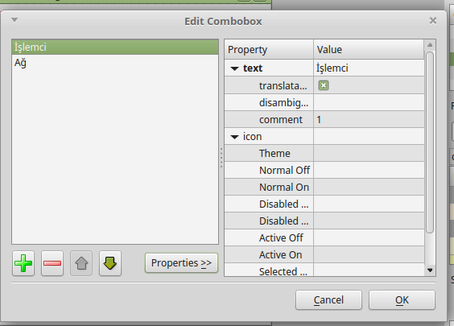

Grafik Çizdirme
===============

Bir veri kaynağından sürekli akan sayıları canlı grafik olarak gösterecek bir uygulama yazacağız.

Basitlik açısından, tek pencere ile çalışacağız. Birden fazla kaynağın verilerini istediğimiz
zaman aralıklarında örnekleyen ve bu bilgiyi görselleştiren bir uygulama yazacağız.

Uygulamaya geçmeden önce kurmanız gereken ek modüller:

 * psutil : İşletim sisteminden bağımsız performans metrikleri sağlar.
 * pyqtgraph : Çizim kütüphanemiz.

Designer içinde tasarım yaparken, pyqtgraph nesnesi yerleştirebilmek mümkündür.
Aşağıdaki bilgi, pyqtgraph belgesinden türkçeye çevirilmiştir:

PyQt Uygulamasının içine pyqtgraph nesneleri yerleştirme
--------------------------------------------------------
Pyqtgraph kütüphanesi tarafından sağlanan nesneleri, designer uygulaması içinde
herhangi bir Qt nesnesi gibi yerleştirebilmek mümkündür. PlotWidget, ImageView,
GraphicsLayoutWidget ve GraphicsView nesneleri en önemli olanlarıdır. Bu nesneler,
designer içinde 'Promote To...' özelliği ile ui dosyasının içine eklenirler. Bu işlem için:

 1. Designer'da pencerenize QGraphicsView nesnesi yerleştirin.
 2. Bu nesneye fare sağ tuşu ile tıklayıp, 'Promote To...' seçin.
 3. 'Promoted class name' kısmında, kullanmak istediğiniz pyqtgraph nesnesinin adını yazın. (PlotWidget, GraphicsLayoutWidget gibi)
 4. 'Header file' kısmına 'pyqtgraph' yazın.
 5. 'Add' butonuna basın ve ardından 'Promote' butonuna basın.

Uygulamamıza bir combobox yerleştiriyoruz. İşlemci ve Ağ adında iki eleman ekleyip,
her birinin comment alanına işlemci için 1, ağ için 2 yazıyoruz.

Yukarıda anlatıldığı gibi QGraphicsView ekleyip, PlotWidget'a çeviriyoruz.
Pencere için oluşturulmuş diyalog'a da dlgGrafik adını verip kaydediyoruz.

   QGraphicsView nesnesinin pyqtgraph PlotWidget'a dönüştürülmesi.

   Combobox comment kısmı düzenleme

Promote işlemi sonrasında, uic ile üretilen python kodunun içine

.. code-block:: python

   from pyqtgraph import PlotWidget

satırının eklendiğini göreceksiniz.

psutils modülünü kullanarak çizilecek sayıları sağlayacak bir nesne hazırlayacağız.

   İşlemci Yükü, 0-100 aralığında

   Ağ trafiği, gelen byte

Veri Sinifi
-----------

.. literalinclude:: ../ornekler/004/veri.py
   :language: python

Ana Uygulama
------------

.. literalinclude:: ../ornekler/004/cizim.py
   :language: python

